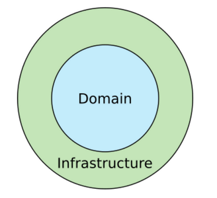
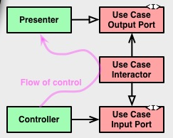
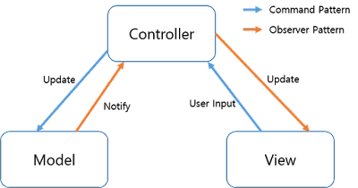
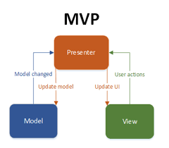
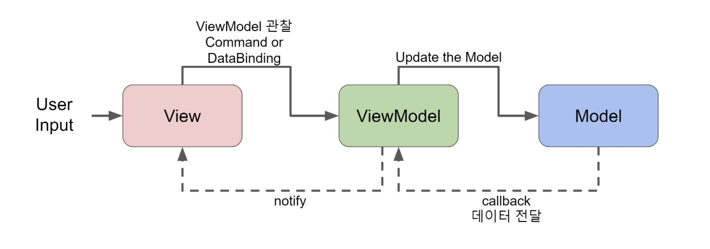
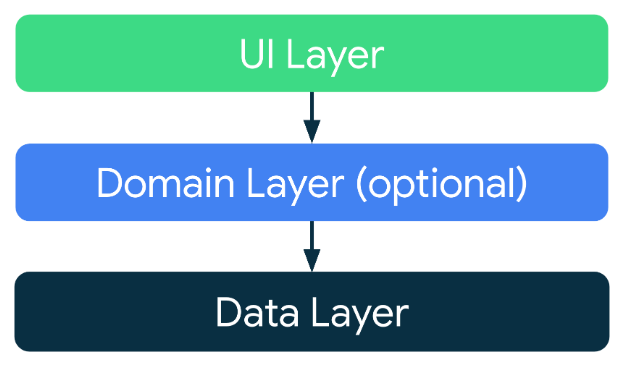
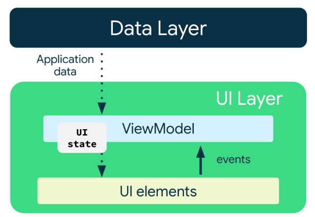

# Clean Architecture

Business Rule(Logic)이란 

> 프로그램에서 사용자에게 보이지 않고 사용자에게 결과물을 올바르게 도출할 수 있도록 짜여진 코드 로직으로, 데이터가 어떻게 생성되고 저장되고 수정되는 부분이다. 즉, 프로그램에서 데이터를 처리하는 부분이다.

System Architecture란 

> 시스템의 structure, behavior, view를 정의하는 개념적인 모델이다. 시스템의 구성과 동작 원리를 나타내며, 시스템의 목적을 위해 각 컴포넌트가 어떻게 상호작용하고 데이터가 어떻게 공유되는 지를 설명한다. 시스템의 전체적인 최적화를 목표로 한다.
>
> System Architecture의 특징
>
> * Independent of Frameworks : System Architecture는 라이브러리나 프레임워크에 한정적이지 않기 때문에 프레임워크 독립적이다.
> * Testable : Business Logic을 분리하여 UI, DB 등 다른 요인에 관계없이 테스트 케이스를 작성할 수 있다.
> * Independent of UI : 시스템의 다른 부분을 고려하지 않고 UI를 변경할 수 있다.
> * Independent of Database : Business Logic과 상관없이 DB를 독립적으로 변경할 수 있다.
> * Independent of any external agency : Business Logic을 분리하기 때문에 Business Logic은 UI, DB등 외부 요인을 알 필요가 없다.

Clean Architecture를 그림으로 간단하게 표현하면 이렇다.

이미지 출처 : https://pusher.com/tutorials/clean-architecture-introduction/

Domain 영역은 Business Rule이 존재하는 영역이다.

Infrastructure 영역은 UI, DB, Framework 등이 존재하는 영역이다.

Clean Architecture에서는 Dependency Rule을 따라야 한다.

Dependency Rule이란 모든 소스코드의 의존성은 바깥쪽(outer)에서 안쪽(inner)으로 향해야 한다는 것이다. 즉, 위의 그림에서는 Infrastructure는 Domain에 의존성을 갖질 수 있지만, Domain은 Infrastructure에 의존성을 가지면 안된다. 따라서 Domain 영역에서는 Infrastructure에 관한 정보를 아무것도 모른다.

위의 그림을 더 자세히 표현해보면 아래의 그림으로 표현할 수 있다.

이미지 출처 : http://blog.cleancoder.com/uncle-bob/2012/08/13/the-clean-architecture.html

Entities

>  Entities는 enterprise business rule을 캡슐화한 것이다. entity는 하나의 객체가 될 수도 있고, 데이터 구조와 함수들의 집합이 될 수도 있다. entity는 응용프로그램에 종속되지 않기 때문에 어떤 응용프로그램에서던 entity를 사용할 수 있다. 한 응용프로그램 내에서의 entity는 프로그램의 business object이다. business object는 외부 요인이 바뀌더라도 바뀌지 않는 가장 일반적이고 높은 레벨의 rule을 캡슐화 한 것이다.

Use Cases

> Use Cases는 특정한 응용프로그램의 business rule이 속하는 계층이다. 시스템의 모든 use case를 구현한 것이다. Use Cases는 entity간의 데이터 흐름을 조정하고, entity가 use case의 목표를 달성하도록 business rule을 사용하게 지시한다. Use Case의 변경 사항이 entity에 영향을 미치면 안된다. 또, UI, DB같은 외부요인의 변경사항이 Use Case에 영향을 미쳐서도 안된다. (Dependency Rule) Use Case는 응용 프로그램 작동이 변경되면 영향을 받는다.

Entities와 Use Cases가 첫 번째 그림의 Domain 영역에 속한다.

Interface Adapter

> Interface Adapter는 외부 인터페이스나 DB에서 받은 데이터를 use case와 entity에게 편리한 형태의 데이터로 변환해주는 역할을 하는 계층이다. Presenter, Controller 등이 여기에 속한다. 또한, Interface Adapter는 use case와 entity의 결과물을 외부 인터페이스에 표현하거나 DB에 저장하기 쉬운 형태의 데이터로 바꿔주는 역할도 한다.

Frameworks and Drivers

> Frameworks and Drivers는 Clean Architecture에서 가장 바깥쪽에 있는 영역이다. 이 영역은 UI나 DB같은 framework나 tool로 구성된다. UI나 DB의 세부사항이 여기에 들어간다.

Clean Architecture의 구역은 꼭 4개가 아닐 수도 있다. 하지만 Dependency Rule은 항상 적용되어야 한다.

Crossing boundaries

>
>
>이 그림은 구역간 경계를 넘는 방법의 예시로, Controller와 Presenter가 Use Case와 소통하는 것을 보여준다. control의 흐름을 살펴보면 Controller -> Use Case -> Presenter로 흘러간다. 하지만, 의존성을 살펴보면 Controller와 Presenter 모두 의존성이 Use Case를 향하여 있다. 이러한 모순은 의존성 역전 원리(Dependency Inversion Principle)를 통해 해결한다.
>
>> 의존성 역전원리
>>
>> 상위 계층이 하위 계층에 의존하는 의존 관계를 역전시켜 상위 계층이 하위 계층으로부터 독립하도록 할 수 있다.
>>
>> 1. 상위 모듈은 하위 모듈의 그 어떤 것도 import 해서는 안된다. 상위 모듈과 하위 모듈 모두 추상화에 의존해야 한다.
>> 2. 추상화는 구체적인 구현에 의존해서는 안된다. 구체적인 구현이 추상화에 의존해야 한다.
>
>Use Case에서 Presenter를 호출해야할 경우를 생각해보면, 이 호출은 Dependency Rule을 위반하는 호출이다. 따라서 Presenter가 implement하는 interface를 만들어두고 Use Case에서는 이 interface를 호출하여 Use Case가 Presenter의 세부적인 내용을 모르도록 한다. (그림에서는 Use Case Output Port가 이 Interface이다.)
>
>이러한 기술이 Clean Architecture의 모든 경계를 넘을 때 사용된다.

What data crosses the boundaries

> 일반적으로 경계를 넘는 데이터는 단순한 데이터 구조이다. 데이터 전달 객체를 사용할 수도 있고, 데이터가 단순히 함수 호출의 결과일 수도 있다. 중요한 것은 이러한 데이터 구조들이 계층간 경계를 넘는다는 것이다. 데이터 구조가 Dependency Rule을 위반하는 의존성을 가져서는 안된다. 따라서 데이터를 경계 넘어로 전달할 때에는 항상 경계 안쪽의 계층에서 편리한 형태의 형태로 변환하여 전달해야 한다.

참고 문헌  

http://blog.cleancoder.com/uncle-bob/2012/08/13/the-clean-architecture.html

# Design architecture pattern

Design pattern

> 디자인 패턴이란 소프트웨어 개발 과정에서 발견된 설계 방법에 이름을 붙여 재사용하기 좋은 형태로 규약을 만들어 정리한 것이다. 디자인 패턴은 소프트웨어 설계에서 공통적인 문제들에 대한 표준적인 해결책을 제안하고 구조적인 문제를 해결하는 방식이다.

## MVC pattern

MVC pattern은 소프트웨어를 Model, View, Controller 3가지의 역할로 구분한 디자인 패턴이다.

Model

> Model은 소프트웨어 내에서 사용되는 모든 데이터를 저장하고 있는 공간이다. Controller로 부터 받은 데이터를 가공하고 처리하는 역할을 한다. 모델이 변경되면 Controller에 변경사항을 알린다.

View

> 사용자에게 보여지는 UI 요소를 나타낸다. View는 Model에 있는 데이터를 저장하면 안된다. View는 Model이나 Controller의 동작 방식을 알아서는 안되고 오직 데이터를 받아 화면에 표시하는 역할만 한다.

Controller

> Model과 View를 이어주는 중간자 역할을 하며 Model과 View의 변경을 관찰하고 서로에게 통보해준다. 

MVC pattern의 한계

> View와 Model간의 의존성을 완벽히 지우지 못했다.

## MVP pattern

MVP pattern은 소프트웨어를 Model, Presenter, View로 구분한 디자인 패턴이다.

Model

> 프로그램 내부에서 사용되는 데이터를 저장하고, 처리하는 business logic을 포함하는 영역이다. View와 Presenter에 의존성을 가지고 있지 않다.

View 

> UI를 담당하는 부분으로 Presenter를 통해 Model의 데이터를 전달받아 User에게 보여주는 역할을 한다. User와 상호작용하여 이를 Presenter에 전달한다. Presenter에 의존적이다.

Presenter

> Model과 View를 연결해주는 매개체로서 MVC pattern의 Controller와 비슷하지만, View에 직접 연결되지 않고 interface를 통해서 상호작용한다. interface를 통해 상호작용하므로 MVC pattern이 가지는 한계를 해결할 수 있다. 

MVP pattern의 한계

> 소프트웨어가 복잡해질 수록 View와 Presenter 사이의 의존성이 강해진다.

## MVVM pattern

Model, View, ViewModel로 구성되어있는 디자인 패턴이다.

Model

> business logic과 데이터를 포함하는 영역이다. 앱에서 사용할 데이터와 관련된 행위를 다룬다. Model은 View와 ViewModel에 의존성이 있으면 안된다.

View 

> UI를 담당하고 데이터를 표시하는 역할로 business logic을 포함하지 않는다. ViewModel을 관찰하고 상태 변화를 전달 받으면 화면을 갱신한다.

ViewModel

> View와 Model 사이의 매개체 역할을 한다. MVP pattern의 Presenter와 다르게 ViewModel은 View에 의존성이 없다. View가 사용할 메소드와 필드를 구현하고, View에 상태 변화를 알린다. Model의 데이터를 가공하여 View가 필요한 형태로 만든다. ViewModel과 Model은 1대다 관계를 형성할 수 있다.

# Android Clean Architecture

Android에서의 Clean Architecture 적용은 일반적으로 3개의 Layer로 이루어진다.

UI Layer

> UI의 역할은 애플리케이션의 데이터를 화면에 표시하고, 사용자와의 상호작용을 제공하는 것이다. 사용자와의 상호작용으로 인해 데이터에 변화가 생긴다면 UI는 이러한 변화를 반영하도록 업데이트 되야한다. Data Layer에서 받은 애플리케이션 데이터가 UI에 표시해야할 데이터 형식과 다른 경우에 UI Layer는 데이터를 UI에서 표시할 수 있는 데이터로 변환하는 파이프라인의 역할을 한다.
>
> UI Layer는 다음 4가지 단계를 수행해야 한다.
>
> 1. 앱 데이터를 소비하고 UI에서 쉽게 렌더링할 수 있는 데이터로 변환해야 한다.
> 2. UI에서 렌더링할 수 있는 데이터를 소비하고 사용자에게 보여주기 위해 UI 요소로 변환해야 한다.
> 3. UI 요소로부터 사용자의 입력 이벤트를 소비하고 필요핟면 UI 데이터에 반영해야한다.
> 4. 1~3단계를 필요한 만큼 반복해야한다.
>
> State holders
>
> 
>
> UI state를 생성하고 해당 작업에 필요한 로직을 포함한 클래스를 State holder라고 한다. 일반적으로 ViewModel로 구현되며, 경우에 따라 간단한 클래스로 구현될 수도 있다.

Domain Layer

> Domain Layer는 UI Layer와 Data Layer 사이에 존재하는 추가적인 Layer다. Domain Layer는 복잡하거나 여러 ViewModel에서 사용되는 비지니스 로직을 캡슐화 하는 역할을 한다. Domain Layer를 사용하면 다음 4가지의 이점을 얻을 수 있다.
>
> 1. 코드 중복을 피할 수 있다.
> 2. Domain Layer를 사용하는 클래스들의 가독성을 향상시킬 수 있다.
> 3. 앱을 더 쉽게 테스트할 수 있다.
> 4. 책임을 분할하여 거대한 클래스가 만들어지는 것을 피할 수 있다.
>
> 각 use case는 하나의 기능에만 책임을 가져야하며, 변형이 가능한 데이터를 포함해선 안된다. use case는 UI Layer의 ViewModel과 Data Layer의 repository 사이에 존재해야하고, 따라서 repository에 대한 의존성만을 가져야 한다. 또한, use case는 재사용 가능한 로직을 포함하고 있기 때문에 다른 use case에서 사용될 수도 있다.

Data Layer

> Data Layer는 애플리케이션 데이터와 비지니스 로직으로 이루어져 있다. 이 비지니스 로직은 애플리케이션 데이터가 어떻게 생성되고, 저장되고, 바뀌는 지에 대한 비지니스 룰로 이루어져있다.
>
> Data Layer는 Data Sources와 Repositories로 이루어져 있다. repository는 앱에서 처리하는 데이터의 유형별로 만들어져야 한다. repository는 다음 5개의 작업을 담당한다.
>
> 1. 데이터를 앱의 다른 부분에 노출시키는 것.
> 2. 데이터의 변화를 집중시키는 것.
> 3. 다수의 data source사이의 충돌을 해결하는 것.
> 4. 앱의 다른 부분에서의 데이터를 추상화 시키는 것.
> 5. 비지니스 로직을 포함하는 것.
>
> Data Source 클래스는 하나의 데이터 소스로 작업하는 것에만 책임이 있어야 한다. 하나의 파일이 될 수도 있고, 네트워크 소스가 될 수도 있고, 로컬 데이터베이스가 될 수도 있다. Data Source 클래스는 데이터 작업을 위해 애플리케이션과 시스템 사이를 연결해주는 역할을 한다.

