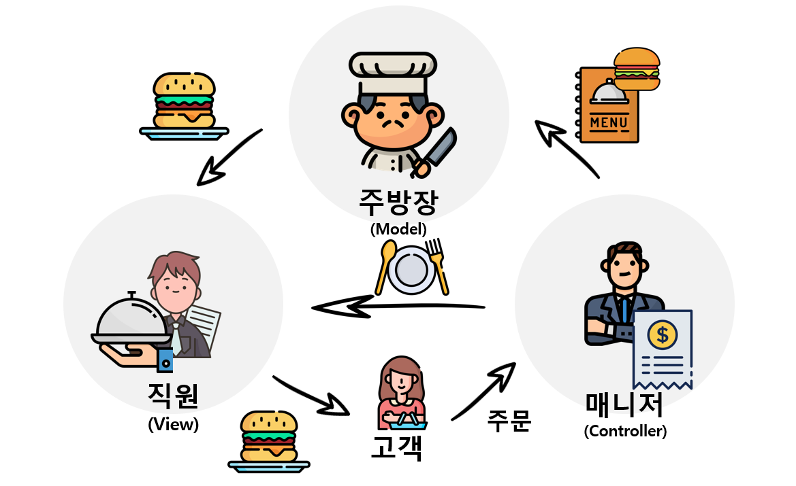

# MVC
MVC(Model-View-Controller)는 소프트웨어의 디자인패턴 중 하나이다. 비즈니스 로직과 화면으로 구분되어진다. 

## Model
- **데이터**와 **비즈니스 로직**을 관리한다.

## View
- **레이아웃**과 **화면**을 구성한다. 

## Controller
- 명령을 모델과 뷰 부분으로 **라우팅**한다.
  - 라우팅은 네트워크에서 특정 경로로 데이터를 보낼 때 사용되는 과정을 말한다. 예를 들어, 서울에서 부산으로 여행을 갈 때 버스, 비행기, 기차를 타고갈 수 있다. 이러한 경로들 중 하나를 선택하는 것이 라우팅이라고 할 수 있다.

## 예시
게시판을 예로 들어볼 수 있다. 
- 게시판에서 쓰이고 읽히고 수정되는 글 -> DB에 데이터로 저장 => 이 데이터의 형식을 지정하고 저장하고 불러오는 작업들에 관한 코드 **Model**
- 게시판으로 사용자들이 목록과 글 들이 시각적 표현을 **View**
- View와 Model을 연결 및 Model 데이터를 View에 연결해서 사용자가 GUI화면을 통해 데이터를 읽고 쓰고 제어할 수 있느 것을 **Controller**

# Reference
[#1 MVC 개념 설명] 
https://developer.mozilla.org/ko/docs/Glossary/MVC

[#2 라우팅이란?] 
https://dentuniverse.tistory.com/14
