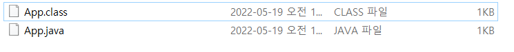
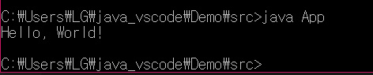

# JVM
JVM이란 Java Virtual Machine이다. 직역하면 **'자바를 실행하기 위한 가상머신이다.'** 

자바 소스코드(MyProgram.java)를 My Program(OS)에서는 읽을 수 없다. 그렇기 때문에 이를 바이트코드로 전환하는데 사용하는 것을 Compiler이고 이는 자바를 설치하면 JDK에 있는 javac.exe에서 실행된다. 바이트코드로 전환된 소스코드(MyProgram.class)는 OS에서 여전히 읽을 수 없는데, 여기서 OS로 읽게 기계어로 번역해주는 것을 **JVM**(Java Virtual Machine)이다.

```java
// test.java 파일
public class test{
  public static void main(String[] args){
    System.out.println("test");
  }
}
```
```bash
# cmd 창을 열어서 App.java파일이 있는 곳으로 이동하여 JDK 설치가 완료된 javac 커맨드를 입력하여 컴파일할 수 있다. 결과적으로 App.class 파일이 바탕화면에 생성됨을 확인할 수 있다.
C:\Users\LG\java_vscode\Demo\src>javac App.java
```
<br>
- 생성된 .class 파일을 cmd창 내에서 실행해보기

```bash
C:\Users\LG\java_vscode\Demo\src>java App
```


## 바이트 코드
가상 컴퓨터(Virtual Machine)에서 돌아가는 실행 프로그램을 위한 이진 표현법

## ✍바이너리 코드란
바이너리 코드란 즉, 이진 코드라고 한다. 컴퓨터가 인식할 수 있는 0과 1로 구성된 이진코드

## ✍기계어란
0과 1로 이루어진 바이너리 코드<br>
기계어 -> 이진코드 (O)<br>
모든 이진코드 -> 기계어 (X)<br>
기계어는 특정 언어가 아니라 CPU가 이해하는 명령어 집합

즉, CPU 이해하는 언어 -> 바이너리 코드<br>
가상 머신이 이해하는 언어 -> 바이트 코드<br>

## JIT 컴파일러
JIT 컴파일러는 Just In Time Compliation 이며 동적 번역(dynamic translation)이라고 한다.<br>
JIT 컴파일러는 프로그램을 실제 실행하는 시점에 기계어로 번역하는 컴파일러이다.


# JVM 구성요소


- 클래스 로더
- 실행 엔진
  - 인터프리터
  - JIT 컴파일러
  - GC(Garbage Collector)
- 런타임 데이터 영역

## 클래스 로더
JVM 내 클래스 파일(*.class)을 로더하고, 링크를 통해 배치하는 작업을 수행
## 실행 엔진
클래스를 실행시키는 역할<br>
1. 인터프리터
   - 자바 바이트 코드를 명령어 단위로 읽어서 실행, 한 줄씩 읽기 때문에 느리다..
2. JIT(Just In Time)
   - 인터프리터 방식으로 실행하다 적절한 시점에 바이트 코드 전체를 컴파일하여 기계어로 변경, 이후에는 더이상 인터프리팅 하지 않고 기계어로 직접 실행
3. GC(Garbage Collector)
   - 더 이상 필요하지 않은 인스턴스를 찾아 메모리에서 삭제

## 런타임 데이터 영역

Runtime Data Area는 프로그래을 수행하기 위해 OS에서 할당받은 메모리 공간

### ✍프로세스란
데이터와 메모리 자원 등 그리고 스레드로 구성
### ✍스레드란
작업의 흐름, 모든 프로세스는 한 개 이상의 스레드로 구성된다.
1. PC Register
   - 스레드가 시작될 때 생성(공간 생성)
2. JVM 스택 영역
   - 프로그램 실행과정에서 임시로 할당되었다가 메소드를 빠져나가면 바로 소멸되는 특성의 데이터를 저장하기 위한 영역
3. Native Method Stack
   - 자바 프로그램이 컴파일되어 생성되는 바이트 코드가 아닌 실제 실행할 수 있는 기계어로 작성된 프로그램을 실행시키는 영역
4. Method Area(= Class Area, = Static Area)
   - 클래스 정보를 처음 메모리 공간에 올릴 때 초기화되는 대상을 저장하기 위한 메모리 공간
   1. Runtime Constant Pool
      - 상수 자료형을 저장하여 참조하고 중복을 막는 역할을 수행 

# JDK와 JRE의 차이
## ✍ SDK이란?
Software Development Kit 이라고 하며, 하드웨어 플랫폼과 운영체제 또는 프로그래밍 언어 제작사가 제공하는 툴이다.
## JDK
JDK 란 Java Development Kit이라고 하며, java를 실행시키기 위한 모든 기능을 가진 툴이다. 또한, JDK는 JRE를 포함하고 있다. 즉, JDK는 실행, 생성, 컴파일러를 할 수 있다.
## JRE
JRE 란 Java Runtime Enviroment(자바 런타임 환경)이라고 하며, JVM + 자바 클래스 라이브러리등으로 구성된다. 컴파일된 JAVA클래스를 실행하는데 사용한다.

# Reference
[#1 JVM이란?]<BR>
https://doozi0316.tistory.com/entry/1%EC%A3%BC%EC%B0%A8-JVM%EC%9D%80-%EB%AC%B4%EC%97%87%EC%9D%B4%EB%A9%B0-%EC%9E%90%EB%B0%94-%EC%BD%94%EB%93%9C%EB%8A%94-%EC%96%B4%EB%96%BB%EA%B2%8C-%EC%8B%A4%ED%96%89%ED%95%98%EB%8A%94-%EA%B2%83%EC%9D%B8%EA%B0%80


[#2 jvm, dvm, art ]<Br>
https://charlezz.medium.com/jvm-dvm-art-%EC%9D%B4%ED%95%B4%ED%95%98%EA%B8%B0-c51d10dc56e3

