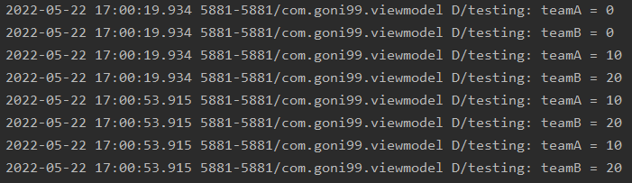

# ViewModel
앱의 수명주기 동안 몇 가지 구성 변경 중 회전이 있다.
아래 그림처럼 회전 시 앱이 다시 업로드 되며 데이터가 초기화되는 것을 알 수 있다. 이를 해결하기 위해서 android jetpack 구성 요소 중 viewmodel을 사용하여 UI관련 데이터의 수명주기를 인식하여 개선할 수 있다.


# Activity LifeCycle


# ViewModel LifeCycle


Activity와 ViewModel의 수명주기를 보면 알 수 있듯이, viewmodel의 scope는 액티비티의 수명주기 끝까지 관리한다. 그렇기 때문에 액티비티의 수명주기가 바뀐다고 하더라고 viewmodel 은 유지되는 것이다.

# 간단한 예
## 1. ViewModel 클래스 만들기
```kt
class MainViewModel:ViewModel() {
    var teamA = 0

    var teamB = 0
}
```

## 2. UI컨트롤러와 ViewModel 연결
UI컨트롤러는 액티비티나 프래그먼트를 의미.<br>
> ✍ 여기서 주의할 점 viewmodel은 context에 대한 참조를 보유해서는 안된다. 그 이유는 viewmodel이 특정 UI컨트롤러 인스턴스보다 오래 지속되기 때문이다. 예를 들면, 화면을 3번 세로-가로를 반복하면 액티비티는 3번의 수명주기를 반복하지만 -> viewmodel은 한 번이다.
```kt
class MainActivity : AppCompatActivity() {

    lateinit var mainViewModel: MainViewModel

    override fun onCreate(savedInstanceState: Bundle?) {
        super.onCreate(savedInstanceState)
        setContentView(R.layout.activity_main)
        mainViewModel = ViewModelProvider(this, ViewModelProvider.NewInstanceFactory())
            .get(MainViewModel::class.java)

    }
}
```

## 3. UI 컨트롤러에서 ViewModel 사용
```kt
Log.d("testing", "teamA = ${mainViewModel.teamA}")
Log.d("testing", "teamB = ${mainViewModel.teamB}")

mainViewModel.teamA = 10
mainViewModel.teamB = 20
Log.d("testing", "teamA = ${mainViewModel.teamA}")
Log.d("testing", "teamB = ${mainViewModel.teamB}")
```
아래 사진처럼 화면을 처음 실행했을 때 data 값이 0이였지만 화면을 계속 전환해도 안바뀌는 것을 알 수 있다.



# Reference
[#1 ViewModel test]<br>
https://medium.com/androiddevelopers/viewmodels-a-simple-example-ed5ac416317e