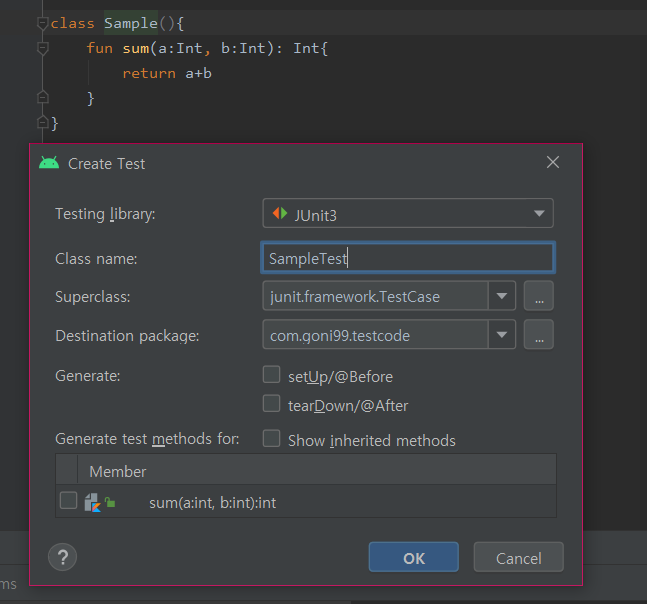
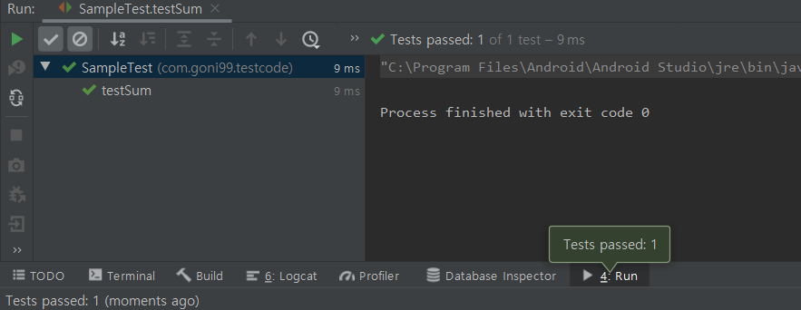
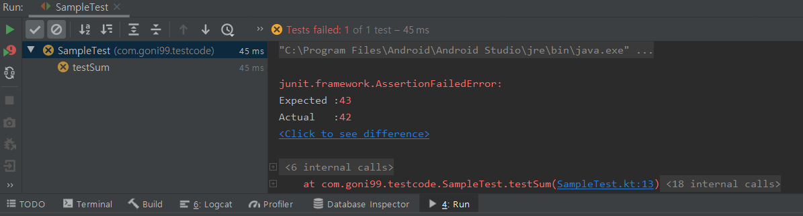

# Test Code

위 사진처럼 0.02의 차이로 큰 변화를 일으킬 수 있다. 이 처럼 우리의 코드에서도 미세한 차이로 오류가 발생한다. 이러한 문제점을 개선하기위해서 큰 코드를 잘개 나누어 작은 코드로 만든 후 작은 코드에서 오류를 찾아 개선하며 테스트를 진행한다. 이를 테스트 코드라고 한다.

# Kotlin Test Code Tutorial
## 1. 종속성 추가
```kt
dependencies {
    testImplementation 'org.jetbrains.kotlin:kotlin-test'
}
```

## 2. 테스트할 코드 추가
```kt
class Sample(){
    fun sum(a:Int, b:Int): Int{
        return a+b
    }
}
```

## 3. 테스트 만들기
- 클래스 이름 우클릭 후 GO TO -> Test -> Create New Test...

- 생성 파일 경로는 Project/app/src/test/java/com.goni99.testcode
```kt
internal class SampleTest {

    private val testSample: Sample = Sample()

    @Test
    fun testSum() {
        val expected = 42
        assertEquals(expected, testSample.sum(40, 2))
    }
}
```

## 오류 시 코드
```kt
internal class SampleTest {

    private val testSample: Sample = Sample()

    @Test
    fun testSum() {
        val expected = 43
        assertEquals(expected, testSample.sum(40, 2))
    }
}
```



## 4. 테스트 실행

# Reference
[#1 Test Code]<br>
https://velog.io/@walker/TDDTestCode%EB%8A%94-%EC%99%9C-%ED%95%A0%EA%B9%8C

[#2 TDD]<br>
https://velog.io/@modolee/tdd-overview

[#3 Test Code JUnit In JVM]<br>
https://kotlinlang.org/docs/jvm-test-using-junit.html